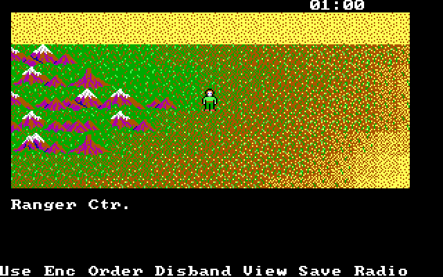
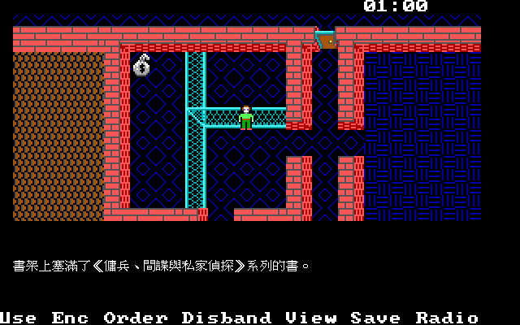
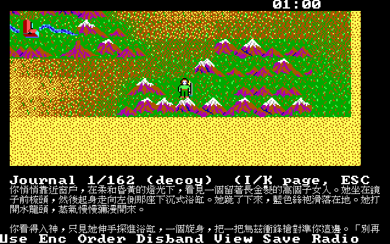
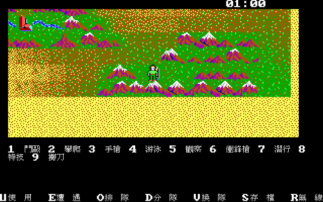
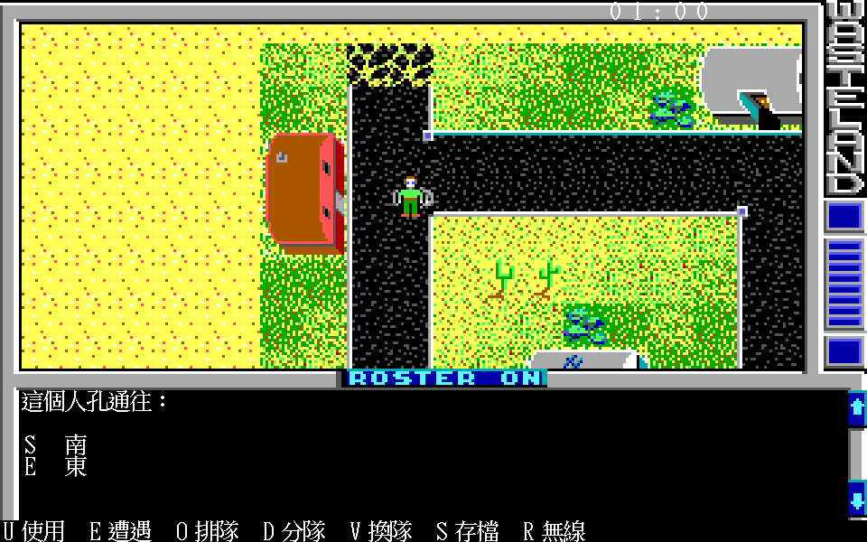
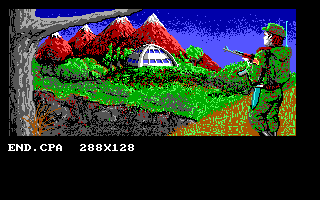
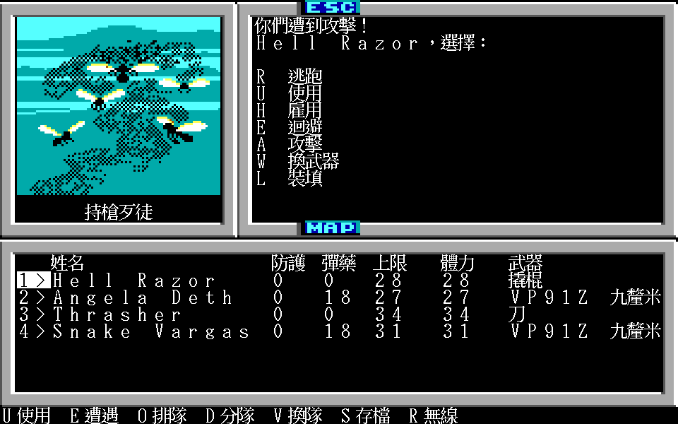
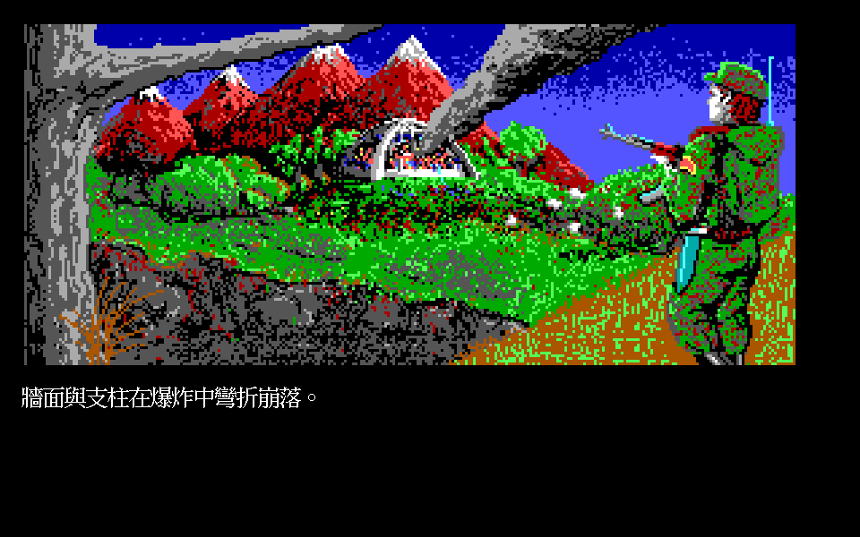

# Wasteland 荒野遊俠 — 逆向、重製與繁體中文化

1988 年，Interplay 做出了《Wasteland》。核廢土、變種人、一支叫 Desert Rangers 的
巡守隊——後來《異塵餘生》的血緣從這裡開始。1990 年前後它進了台灣，
軟體世界替它印了一本中文說明書，把它譯成《荒野遊俠》。

那本說明書現在很難找了。遊戲本身也是：DOS 版跑不動、劇情段落印在紙上、
英文濃到當年多數人玩不完。這個專案想把兩件事一起留下來——
**一個玩得完的引擎，和一份讀得懂的譯本**。

---

## 畫面

中文走倚天 24×24 點陣字、英數走倚天同高的半形 `ASCFONT.24`，
畫面因此是 960×600（原版 320×200 的三倍）；
地圖、圖磚、肖像、音效全部來自原版資料，玩家自備。
**畫面上的字全部走語言資料檔**——包括指令列與手札這種原版寫死成 ASCII、
抽不出 key 的介面文字（`translations/*/ui.tsv`）。
⚠ 熱鍵字母不跟著翻譯走：譯文寫成「U使用」，比對永遠用那個靜態字母。

| | |
|---|---|
|  |  |
| **地圖**：底部是原版的指令列，熱鍵字母照原版不跟著翻譯走 | **訊息**：4,915 條可翻字串已全部翻完 |
|  |  |
| **手札**：段落書 162 段做進遊戲，按 `P` 翻閱（`I`／`K` 換段、`↑`／`↓` 捲動）；陷阱段落標「誘餌」 | **USE**：技能／物品／屬性三選一，判定照原版的字母表 |
|  |  |
| **密語**：問答有單鍵與打字兩種模式；**答案不翻譯**——比對逐 byte 全等，翻了就永遠打不出來 | **結局**：`END.CPA` 兩段全解——畫面 ＋ 一份 15 格的動畫腳本 |
|  |  |
| **戰鬥**：版面照原版——肖像在左、指令選單在右上那一塊（欄 15–38、列 1–13）、名單排在下半、指令列照留 | **後日談**：《遊俠史》第二卷的獻詞，**原版玩不到**，收進手札保存 |

---

## 1998 年，衛星從天上消失

上面那幾張圖是重製版跑出來的。至於畫面裡那支四人小隊為什麼會走在沙漠中間，
得從 1998 年講起——遊戲設定裡的 1998 年。

軟體世界那本說明書第一章就把來龍去脈交代完了：美國的「城堡」星站由軍方接管，
蘇聯抗議，中立國一個個選邊，六週內只剩三個國家還宣稱中立。然後：

> 　　當“城堡”正式啟用的兩週前，傳來一個不幸的訊息。就在訊息發出的同時，突然大部份的衛星在空中消失，脫離地球的引力圈。在驚慌中，美蘇雙方將 90％ 的核子武器射向天空。這場毀滅相當劇烈，但不徹底。
>
> —— 軟體世界中文說明書〈一、故事介紹〉（[ch01](docs/manual-cht/ch01-story-and-start.md)）

那一天，一隊美國陸軍工程師正在西南部的沙漠裡替乾河床架橋。核彈落下後他們往南邊躲，
接管了那座剛蓋好的聯邦監獄，把死刑犯趕進荒漠。幾星期後他們邀鄰近的難民一起重建，
彼此的猜忌花了很久才消掉。這個聚落後來叫 Ranger Center，說明書給它的中文名字是流浪者中心。
再往後，「擁有一世紀前德州（Texas）與亞利桑納州（Arizona）流浪者優良傳統的
Desert Rangers 誕生了」——你操作的就是這支隊伍。

軟體世界在 CD 盒背面是這樣賣它的：

> 　　不再有虛幻飄渺的法術，不再有猙獰可怖的妖物，在這個核戰後的世界裏，手上緊握的自動步槍、手榴彈、反坦克榴彈，甚至雷射武器將會是你的神劍魔刀。⋯⋯拿起你的烏茲衝鋒槍，走吧！子彈會為你我開路……
>
> —— CD 盒背面文案（[ch08](docs/manual-cht/ch08-package-and-ads.md)）

這段文案沒有誇大。Wasteland 沒有法術欄，隊伍帶的是 7.62mm 與 9mm 彈匣，
彈藥要花錢買，打完一場架地上留下一個袋子等你搜。封面右下角貼著「2 片裝・只賣 NT150 元」。

## 一個沙漠流浪者由什麼構成

文案裡那個「精英戰士」，在遊戲裡的實際樣子是一張數字表。進 Ranger Center 按 `C`，
右上角視窗用亂數擲出一組屬性，不滿意就按空白鍵重擲，滿意了按 RETURN 取名字。
原版的名字欄是 13 個 byte；重製版可以打**十個中文字**——存檔那一格照舊寫得下的部分，
完整名字放進旁邊一個自己的小檔（`WLNAMES`），原版存檔一個 byte 都不動。
說明書逐項解釋這些數字，其中決定戰力的是七項屬性：

| 縮寫 | 中譯 | 說明書怎麼描述 |
|---|---|---|
| ST | 力量 | 打敗敵人及抬起、移動或打破物件的能力，肉搏與破門時特別重要 |
| IQ | 智慧 | 決定能學多少技能，一開始的技能點數與 IQ 相等 |
| LK | 運氣 | 較能躲開敵人攻擊或找到多東西，肉搏戰中表現也較好 |
| SP | 速度 | 越高越能逃離危險的局面 |
| AGL | 敏捷 | 行動的靈巧程度，「使你可閃開對方的一擊並跳上桌子」 |
| DEX | 反應力 | 主宰開鎖或瞄準，「在『三隻手』的技巧上格外有用」 |
| CHR | 魅力 | 「效用雖不明顯，但試圖使某些人相信你時能決定你的生死」 |

—— 屬性說明取自〈三、人物的創設與檢閱〉（[ch02](docs/manual-cht/ch02-characters-and-skills.md)）

IQ 直接換算成技能點數（SKP），而技能是越練越貴的：Clip Pistol 學第一級花 1 點，
第二級 2 點，第三級 4 點。說明書把技能按所需 IQ 分段列出，二十七項，
從 IQ3 的爭鬥、攀爬、游水，一路排到 IQ17 的冶金。條目寫得像有人在旁邊講話：

> **Demolition 爆破(1)：** 教你用多少炸藥才不會把自己炸到九霄雲外的技能。
>
> **Bureaucrac 政治(1)：** 雖然大部份平民都死於核彈之下，卻有為數甚多的下級官吏活了下來；此技能協助你在和他們交涉時能予求予取。

表列完之後，說明書留了一句懸念：「這裏的技能只列到 IQ17，但誰知道 IQ 達到 18 以上是否還有新的技能呢？」
那年沒有 wiki 可查，想知道答案得自己把 IQ 18 的人物擲出來。同一頁還有一條很直接的建議——
「Medic 最好有二人以上學到，以 LEV 在 1 以上比較保險」。理由要等時間開始走才會浮出來。

## 沙漠裡的時鐘

用 `I` `J` `K` `L` 四個鍵移動。走到城鎮、建築或商店旁邊，畫面會問 `Enter New Location（Y／N）？`，
按 `Y` 進去——同時磁碟機會轉一下。說明書提醒這一下不是白轉的：

> 　　同時磁片上的資料也更新為你目前所在的位置，這個過程等於你用 Save 指令存下進度。
>
> —— 〈四、旅行〉（[ch03](docs/manual-cht/ch03-travel.md)）

反過來，這也給了當年玩家一條退路：「假如你的隊員在冒險途中不幸陣亡了，沒有關係，
只要你沒把進度存下來，可再重新開機把他召回來」——代價是這段期間撿到的東西一併蒸發。

不想動的時候按 ESC，時間照樣走，右上角的鐘會跳，生命力慢慢回。說明書注意到一件事：
「在野外按一次 ESC 休息的時間要比在城內長，故在野外休息回復得較快。」
官方英文手冊補上了原理——地圖有大小之分，沙漠圖裡裝著城市圖，城市圖裡裝著建築與下水道，
同一個按鍵在不同尺度的地圖上推進的時間不一樣。而時間對誰都一樣：

> Remember that time waits for no one. Disbanding one character and sending him off across the desert to find a doctor will not freeze time for a seriously-wounded character.
>
> —— 官方英文手冊 TIME AND DISTANCE（[05-injuries-time-places](docs/manual/05-injuries-time-places.md)）

派一個人穿過沙漠去找醫生，重傷的隊員不會在原地等你。這就是為什麼隊伍裡要有兩個人會 Medic。

畫面最底下那列 `Use Enc Order Disband View Save Radio`（本文第一張截圖底部那一排）是隨時能下的六個指令。
Disband 把隊伍拆成最多四支，因為敵人一次只打一支，而且有些地方一次只過得了一個人；
要永久遣散 NPC 的時候，說明書給了一句很實際的提醒：「別忘了先剝下他的裝備。」
Radio 則是回報總部要求升級——MAXCON 加 2 點、兩點自由分配到屬性上、階級改寫。
說明書建議每打完一場就發一次，因為檢閱畫面根本不顯示經驗值，你看不出來夠不夠。

## 你開槍，他們也開槍

會用到 Radio，通常表示前一場架打贏了。而 Wasteland 的槍戰是同時結算的，
英文手冊講得很白：

> Sure, it’s exciting when you burn a clip of AK-97 ammo into an onrushing horde of mutant bikers, but your excitement may diminish somewhat when you find that the mutants are returning fire with equal fervor. You shoot, they shoot.
>
> —— 官方英文手冊 Missile Weapon Combat（[03-commands-and-combat](docs/manual/03-commands-and-combat.md)）

武器分長、中、短三段射程：長程是 AK-97、M1989A1、M19 來福槍、M17 卡賓槍與 LAW 火箭，
中程是 Mac17 與 UZI 27 衝鋒槍，短程是兩把手槍與手榴彈。自動武器可以選單發、
三發點放（Burst）或全自動——全自動把整個彈匣倒出去，命中最高也最燒子彈。
爆炸物的 AMM 永遠顯示 1，丟掉一顆自動補上下一顆，只有 LAW 火箭打完要重新裝備。
卡彈的代價很重：「若戰鬥中你的武器卡彈（Jammed）了，所有彈匣中子彈都會報銷。」

一場仗值不值得打，看的是 CON 掉到 1 以下之後那張表。狀態欄不再顯示數字，
改成三個字母：

| 重傷級數 | 狀況 | CON 訊息 |
|---|---|---|
| 1 | 不省人事 | UNC |
| 2 | 重傷 | SER |
| 3 | 奄奄一息 | CRI |
| 4 | 致命傷 | MOR |
| 5 | 休克 | COM |
| 6 | 死亡 | DEA |

—— 〈五、戰鬥與生命狀況〉（[ch04](docs/manual-cht/ch04-combat.md)）

不省人事會自己醒。從重傷開始就不會了：沒人治療只會一路往下掉，重傷、奄奄一息、
致命傷、休克，最後是 DEA，而死亡是永久的，要用 Disband 把人埋掉。
說明書那一章的收尾是這麼寫的：「唯有健康的隊伍才能迎接任何挑戰，隨時注意各隊員的狀況，
必要時不要吝於進醫院，優秀的隊員是金錢買不到的。」
真的全隊倒下時，左上角會換成一顆骷髏頭，名字叫 Grim Reaper，訊息視窗只有兩行：
`Your life has ended in the Wasteland...`

## 印在紙上的 162 段劇情

打贏打輸都不影響下一件事：玩到某些地方，訊息列會冒出一行 `See Paragraphs ×××`。
遊戲不告訴你發生了什麼，它要你去翻書。

軟體世界把 162 段全部譯成中文，排在說明書第 21 到 47 頁，佔了整本一半以上，
章名就叫「七、劇本」。CD 盒背面把這件事列為特點之一：「唯一採用 “劇本” 式訊息的 RPG，
不但加強了遊戲的戲劇效果，也省去了抄寫訊息之苦。」這同時也是一道防拷門：沒有那本書，
劇情就只剩編號。

第 001 段是留給沒有書的人的：

> **001** 你爬上窗檻，在柔和的晨光中看見一位高䠷的金髮女郎。⋯⋯她忽然一轉身，拿著一把烏茲槍指向你，警告說：「小子，停止閱讀你未被允許讀的劇本，下次我會要求他們把我放在 Bard's Tale 中，Wasteland 這趟任務實在太危險了。」
>
> —— 〈七、劇本〉第 001 段（[ch06](docs/manual-cht/ch06-paragraphs.md)）

這種自曝身分的陷阱段落有三段（001、022、145）。除此之外還有一層更難繞過的設計：
同一個場景常常寫成兩三份，只有密語或號碼不同——Crumb 給的通關密語有 PHOENIX、KESTREL、
CLOVER 三個版本，Ugly 的炸彈解除碼有兩組數字。抄來的答案不一定在你的存檔上成立。
另外還有一整條假劇情線，火星、Phobos、火星皇帝，二十幾段寫得煞有介事。
編號、變體組與誘餌線的整理在 [`docs/paragraphs/`](docs/paragraphs/)；
重製版怎麼處理這本書，見下面的「說明書」一段。

## 1990 年的譯法

那本說明書的體例很清楚：英文原文保留，中文只譯通用名詞。屬性、技能、指令、狀態、
武器類型有中譯，人名、地名、組織與物品專名幾乎原封不動。玩家看著螢幕上的英文，
對照說明書上的中文——在沒有中文版遊戲的年代，這是最實際的作法。

| 說明書中譯 | 英文 |
|---|---|
| 荒野遊俠 | WASTELAND |
| 沙漠流浪者／流浪者中心 | Desert Rangers／Ranger Center |
| 劇本 | Paragraphs |
| 感覺力 | Perception |
| 三隻手 | Sleight of Hand |
| 口才 | Confidence |
| 政治 | Bureaucracy |
| 防護力 | Armor Class |
| 規劃磁片 | Format |
| 聚結功能 | Macro function |

—— 完整對照見 [`glossary-1990.md`](docs/manual-cht/glossary-1990.md)

「三隻手」「口才」「政治」這幾個選字今天讀起來仍然到位；
「規劃磁片」與「聚結功能」則是電腦名詞還沒定案那幾年留下的痕跡。
印出來的英文則留下不少誤植：RADIO 印成 `RAPIO`、Ranger Center 出現過 `Panger Center`
與 `Ranger Cenger Center`、Auto 是 `Anto`、Grenade 是 `Generade`、
Silent Move 是 `Silent Mav`、Metallurgy 是 `Metallargy`。這些字全落在被原樣搬進中文版面的
英文專名與指令上，中文譯名與規則解釋本身前後一致。轉錄一個字都沒有改，差異寫在註記裡——
說明書上印的是什麼，它就是什麼。

有兩處差異值得單獨記下來。故事介紹說六週後只剩「瑞士、瑞典和冰島」中立，
英文原稿寫的是 Ireland（愛爾蘭）；UZI 27 的中文寫「可在 8 秒內射完一個滿滿的 40 發 9mm 彈匣」，
英文寫的是 five seconds。還有一件更大的事：主說明書描述的流程根本不是台灣玩家手上那個版本，
它講的是 Apple II 版——兩片四面磁片、開機按 `S` 或 `U`。IBM 版另附一本黃色小冊，六頁，
教你用 `SETUP.EXE` 把兩片母片轉錄成三片 360K 磁片，再從 EGA、Tandy 16 色、CGA／RGB、
CGA／Composite 四種組合裡挑一個。

這套說明書由軟體世界研究開發中心（SOFT-WORLD RESEARCH CENTRE，高雄郵政 28–34 號信箱）
製作發行。今天還讀得到它，是因為「骨灰集散地」的說明書補完計劃在 2009 年把 33 張掃描建了檔，
發起人聲明不從中取得任何利益。逐頁轉錄在 [`docs/manual-cht/`](docs/manual-cht/)。

以上是 1990 年那本說明書留下來的東西。下面是這個專案目前替它做到的。

---

## 現在做到哪

引擎從標題畫面開場，按 `S` 進遊戲：走地圖、用指令列的七項
（`Use Enc Order Disband View Save Radio` 全部接上）、遇敵打完一場戰鬥、
進商店買賣、找醫生治療、跟訓練師學技能、在 Ranger Center 建角色（名字可以打中文）、
用無線電呼叫總部領表揚與升級、把路上遇到的 NPC 雇進隊伍（原版資料裡有 14 個雇得到的人）、存檔。**遊戲玩得完**：科奇斯基地反應爐層的
四根圓柱、紅黃綠藍四站啟動序列、自毀倒數 240 步，然後結局。訊息是中文的。

| 層 | 狀態 |
|---|---|
| 資料格式 | 42 個 MSQ 區塊、三層地圖、Huffman、壓縮文字、82 張圖片、存檔 byte-for-byte round-trip |
| 規則 | 命中、傷害、護甲、傷勢、回合與行動順序、遭遇生成、技能檢定、升級、商店與醫生 |
| 世界互動 | 移動四道閘、時鐘、44 個腳本 opcode、條件閘、密語問答、段落引用 |
| 音效 | 原版的 PC 喇叭位元組碼直譯器，照 8253 除數合成方波 |
| 介面（重製版加的） | F1 說明、F2 設定、F5／F9 快速存讀檔、F10 離開（先問再先存後退）|
| 配樂（重製版加的） | 十首 MT-32 曲子，跟著場景與晝夜切換；原版沒有背景音樂 |
| 開場與結局 | 標題畫面 → `Start` → 地圖；按別的鍵放原版的六頁開場字幕（1998 年、DEFCON 1）。自毀倒數觸發結局，畫面、15 格動畫、四段敘述與死者點名 |
| 中文化 | 可翻字串 4,915／4,915（原版語料 4,806 ＋ 重製版介面 109）、段落書 162／162 |

**驗收不走「從頭玩到結局」那條路**——一次通關要幾十小時、不可重跑，
中途卡住就什麼都驗不到。改成量**觸發點的覆蓋率**再抽樣：

```
42 張地圖、708 筆條件記錄、2,140 條條件
USE 碰得到 2,066 條、只能走上去觸發 74 條、碰不到 0 條
段落引用 83 條、82 個編號，全部查得到中文正文
```

RE 筆記 114 份，每一份都在[接線表](docs/re/00-wiring-status.md)登記
「這個結論 remake 用上了沒有」——**編得過、測得過、玩得動的結論躺在筆記裡沒人接**
是這個專案最常犯的錯，所以用一支測試雙向守著。

剩下的工作分成四類，**沒有一項擋著把遊戲玩完**：讀長段落的介面
（手札裡可以用 `↑`／`↓` 讀完，踩到格子當場顯示那條還會跳到結尾）、
半成品的介面（卡彈武器名的反白、戰鬥的肖像框）、驗收（設施的實機對拍、
開視窗的人工試玩）、以及還沒讀完的逆向（存檔輪替的序號、戰鬥中敵人在地圖上移動）。
**44 個腳本 opcode 全部實作完**，包含那些要靠改寫存檔才走得到的。
說明書、手冊、段落書與攻略四份文件都已完成，攻略裡的 **31 條機制斷言**
也逐條拿逆向驗過（[對照表](docs/walkthrough/swm-005/mechanics-claims.md)：
相符 22、有出入 4、未定 5）。
逐項在 [`WORKLIST.md`](WORKLIST.md)，現況與術語在 [`CONTEXT.md`](CONTEXT.md)。

## 怎麼跑

需要自備合法的原版《Wasteland》與倚天點陣字。

```bash
tools/go.sh run ./cmd/wasteland -mode play        # 開始玩
tools/go.sh run ./cmd/wl-shot -mode play -out shot.png   # 無頭截圖
tools/go.sh test ./...                            # 全部門檻
```

滑鼠也能玩：點地圖往那個方向走一步、點指令列下指令、點清單選那一項、右鍵取消。
游標用的是原版 `CURS` 的八個圖，而且**跟著狀態換**——指到可點的字換一個、
在地圖視窗上按方向換成箭頭、指到隊伍自己那一格換成十字。
**控制邏輯走重製版自己的路**：原版是把座標比對熱區表換成按鍵碼，
那一套綁死在原版的畫面座標上，功能等價就好（規格 29）。

按鍵：方向鍵走路，`U E O D V S R` 是指令列，`P` 開手札。
`F1` 說明、`F2` 設定、`F5`／`F9` 快速存讀檔、`F10` 離開（會先問一句，也會先存檔）。
**`ESC` 只取消、退一層，任何一層都不會結束遊戲。**

### 背景音樂

原版**沒有背景音樂**——DOS 版只有九首 PC 喇叭音效，其中只有一首是 1.8 秒的旋律。
所以重製版的十首曲子是自己寫的，用 Roland MT-32／CM-32L 算成 ogg：
1988 年 DOS 遊戲的高階音源，年代與機種對得上。

曲子跟著場景走：標題、結局、戰鬥、設施各一首，地圖上再依地點分成荒漠（白天）、
夜間、下水道、拉斯維加斯、科奇斯基地與城鎮。分區的依據是資料講的——
地圖邊長、地圖編號、時鐘的晝夜門檻——配哪一首才是編排決定。

音源 ROM 與算出來的 ogg **都不在版控裡**，與倚天字型、原版遊戲資料同一個政策。
要有音樂就自備 MT-32 ROM 再跑：

```bash
docker build -f docker/media.Dockerfile -t wasteland-media .
tools/render_music.sh                             # → workplace/music/*.ogg
```

沒跑也玩得動，只是沒有音樂；遊戲裡按 `F2` 隨時可以關掉或調音量。

## 這個專案怎麼工作

逆向先行，而且是硬性的：任何機制都要先在 IDA Pro 裡讀出來、寫成**帶輸入檔雜湊
與線性位址**的筆記，收攏成標記 READY 的規格，才允許寫引擎程式碼。
手冊、攻略、社群 wiki 只能在逆向確實定位不到時暫代，而且必須標明。

四道閘門：**RE 確認 → 規格 READY → 實作 ＋ 驗收 → 接線登記**。

最後那一道是後來補上的，因為前三道各自都會綠，而結論仍然可以躺在筆記裡沒人用：
命中公式的 Agility、敵人的目標選擇都解過了，remake 卻一直傳著寫死的常數。
現在 92 份逆向筆記每一份都要在 [`docs/re/00-wiring-status.md`](docs/re/00-wiring-status.md)
登記，`TestWiringStatus` 雙向守著——沒登記會紅，說接了卻沒人引用也會紅。

規範全文見 [`CLAUDE.md`](CLAUDE.md)，逆向筆記在 [`docs/re/`](docs/re/)。

## 說明書

四份文本整理成 markdown：軟體世界 1990 年中文說明書（33 張掃描逐頁轉錄，
**保留當年的譯名與行文**，不用現代用語潤飾）、官方英文手冊（中英對照）、段落書，
以及一份**自建的攻略**。

攻略不是翻譯來的。`cmd/wl-atlas` 把 `game1`／`game2` 裡玩家碰得到的東西倒出來——
店家招牌、每一格擋路的東西與過得去的條件、每一句密語與收得下的答案、
42 張地圖之間的傳送——再由正文按地區編成八章
（[`docs/walkthrough/`](docs/walkthrough/)）。所以那裡不會有二手記憶造成的錯誤，
反過來說，資料看不出來的事情也不會寫。

原版把劇情段落印在紙本、遊戲裡只給編號，那是 1980 年代的防拷手段。
**重製版不移植防拷**：讀到編號就直接把中文正文顯示出來，
另外給一份隨時翻得開的手札。當年用來抓盜版的三段陷阱文字照樣保存，
但在手札裡標明它們是什麼。

## 版權

不散布原版執行檔、資料檔、美術、音樂、說明書掃描與字型。
本專案公開的只有引擎程式碼、工具與翻譯文本，玩家需自備合法原版。
上面的畫面截圖僅供展示重製進度。
